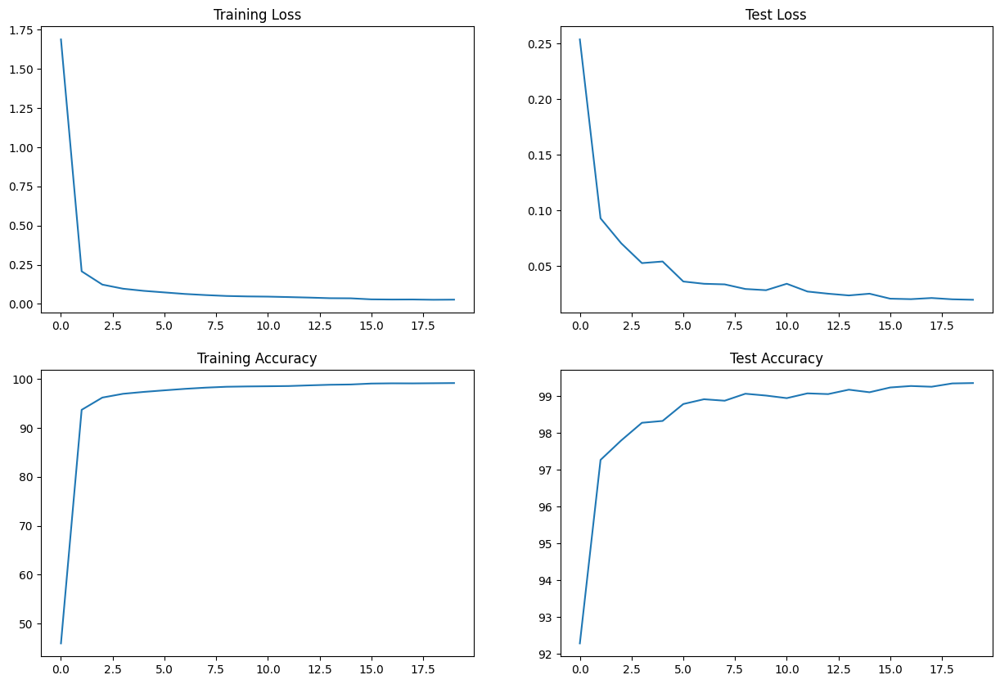

# ERAV1 S5 Assignment


## Overview:
This repository contains files for the Pytorch NN model implementation on MNIST Data.

In this Assignment, We have implementation of basic Convolutional Neural Network model using Pytorch on MNIST data.
Repo has 3 files: 
* [model.py](model.py) (script used to define CNN structure)
* [utils.py](utils.py) (script used to define functions for train,test and getcorrect prediction count)
* [S5.ipynb](S5.ipynb) (Notebook to implement basic CNN using Pytorch on MNIST Dataset)
* README.md (Markup file with description and documentation)

## Usage:

**Requried dependencis for implementation :**

Pytorch installation
```
pip install torch
```
(Former torch-summary) - API to view the visualization of the model, which is helpful while debugging your network
```
pip install torchinfo
```
Visualization package
```
pip install matplotlib
```

## Data :

The MNIST database (Modified National Institute of Standards and Technology database[1]) is a large database of handwritten digits that is commonly used for training various image processing systems.The MNIST database contains 60,000 training images and 10,000 testing images.

**Sample data** : 


## Details About Files In This Directory:

### **model.py** :

model.py has script to define CNN Structure)

``` python
class Net(nn.Module):
    #This defines the structure of the NN.
    def __init__(self):
        super(Net, self).__init__()
        self.conv1 = nn.Conv2d(1, 32, kernel_size=3)
        self.conv2 = nn.Conv2d(32, 64, kernel_size=3)
        self.conv3 = nn.Conv2d(64, 128, kernel_size=3)
        self.conv4 = nn.Conv2d(128, 256, kernel_size=3)
        self.fc1 = nn.Linear(4096, 50)
        self.fc2 = nn.Linear(50, 10)

    def forward(self, x):
        x = F.relu(self.conv1(x), 2) # 28>26 | 1>3 | 1>1
        x = F.relu(F.max_pool2d(self.conv2(x), 2)) #26>24>12 | 3>5>6 | 1>1>2
        x = F.relu(self.conv3(x), 2) # 12>10 | 6>10 | 2>2
        x = F.relu(F.max_pool2d(self.conv4(x), 2)) # 10>8>4 | 10>14>16 | 2>2>4
        x = x.view(-1, 4096) # 4*4*256 = 4096
        x = F.relu(self.fc1(x))
        x = self.fc2(x)
        return F.log_softmax(x, dim=1)
  ```      

### **utils.py** :

utils.py has some basic helper functions to train,test model

**GetCorrectPredCount** : 

Count of Correct prediction
``` python
def GetCorrectPredCount(pPrediction, pLabels):
  return pPrediction.argmax(dim=1).eq(pLabels).sum().item()
```
**train** : 

Input - model , device (Cpu or GPU) , training data , Optimizer and loss function as criterion  <br>     returns - training accuracy and training loss 
``` python
def train(model, device, train_loader, optimizer, criterion):

  model.train()
  pbar = tqdm(train_loader)

  train_loss = 0
  correct = 0
  processed = 0

  for batch_idx, (data, target) in enumerate(pbar):
    data, target = data.to(device), target.to(device)
    optimizer.zero_grad()

    # Predict
    pred = model(data)

    # Calculate loss
    loss = criterion(pred, target)
    train_loss+=loss.item()

    # Backpropagation
    loss.backward()
    optimizer.step()
    
    correct += GetCorrectPredCount(pred, target)
    processed += len(data)

    pbar.set_description(desc= f'Train: Loss={loss.item():0.4f} Batch_id={batch_idx} Accuracy={100*correct/processed:0.2f}')

  train_acc.append(100*correct/processed)
  train_losses.append(train_loss/len(train_loader))
  #return train_acc,train_losses 
```
**test** : 

Input - model , device (Cpu or GPU) , test data , Optimizer and loss function as criterion <br>
returns - test accuracy and test loss  

```   python    
def test(model, device, test_loader, criterion):
    model.eval()

    test_loss = 0
    correct = 0

    with torch.no_grad():
        for batch_idx, (data, target) in enumerate(test_loader):
            data, target = data.to(device), target.to(device)

            output = model(data)
            test_loss += criterion(output, target, reduction='sum').item()  # sum up batch loss

            correct += GetCorrectPredCount(output, target)


    test_loss /= len(test_loader.dataset)
    test_acc.append(100. * correct / len(test_loader.dataset))
    test_losses.append(test_loss)

    print('Test set: Average loss: {:.4f}, Accuracy: {}/{} ({:.2f}%)\n'.format(
        test_loss, correct, len(test_loader.dataset),
        100. * correct / len(test_loader.dataset)))
    #return test_acc,test_losses      
  ```

### **S5.Ipynb** :

* Implementation Notebook loads MNIST data into train and test 
* Apply transformation on data cropping , normalization and standardize on train and test 
``` python
# Train data transformations
train_transforms = transforms.Compose([
    transforms.RandomApply([transforms.CenterCrop(22), ], p=0.1),
    transforms.Resize((28, 28)),
    transforms.RandomRotation((-15., 15.), fill=0),
    transforms.ToTensor(),
    transforms.Normalize((0.1307,), (0.3081,)),
    ])

# Test data transformations
test_transforms = transforms.Compose([
    transforms.ToTensor(),
    transforms.Normalize((0.1307,), (0.3081,))
    ])

```

* Uses model.py and utils.py to create NN , train model and test.
``` python
from model import Net
from utils import *
```
* ## Neural Network Summary :
  * Batch size : 512
  * Learning rate : 0.01
  * Epochs : 20
  * Total parameters trained : 593200
  * Output with `Training accuracy : 99.18 ` and `Test accuracy : 99.36`
```
==========================================================================================
Layer (type:depth-idx)                   Output Shape              Param #
==========================================================================================
Net                                      [512, 10]                 --
├─Conv2d: 1-1                            [512, 32, 26, 26]         320
├─Conv2d: 1-2                            [512, 64, 24, 24]         18,496
├─Conv2d: 1-3                            [512, 128, 10, 10]        73,856
├─Conv2d: 1-4                            [512, 256, 8, 8]          295,168
├─Linear: 1-5                            [512, 50]                 204,850
├─Linear: 1-6                            [512, 10]                 510
==========================================================================================
Total params: 593,200
Trainable params: 593,200
Non-trainable params: 0
Total mult-adds (G): 19.12
==========================================================================================
Input size (MB): 1.61
Forward/backward pass size (MB): 359.38
Params size (MB): 2.37
Estimated Total Size (MB): 363.36
==========================================================================================
```

* ## Train vs Test (Accuracy and Losses) :
 


