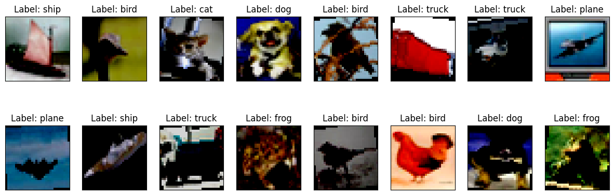
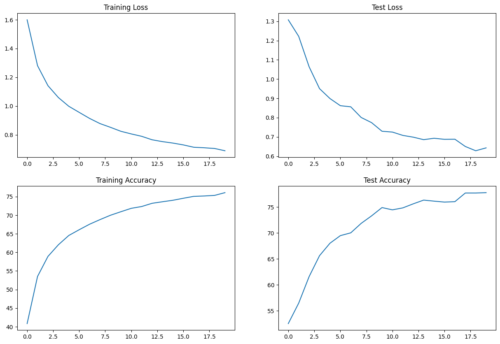
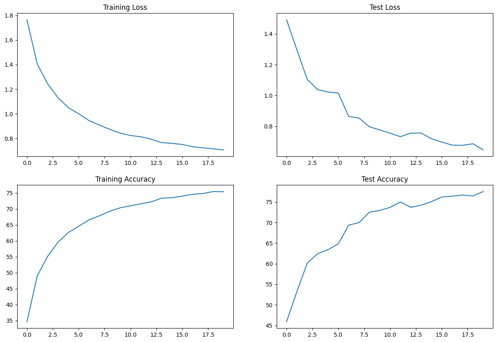
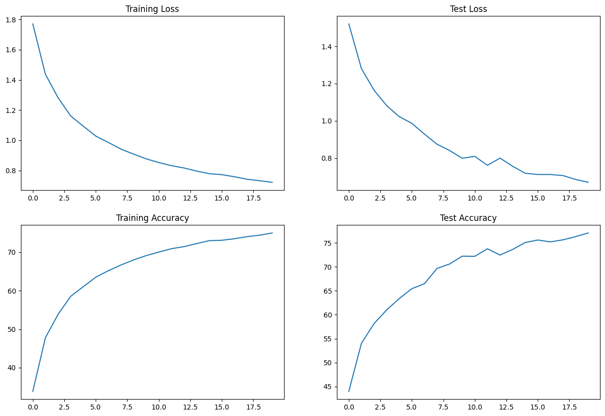
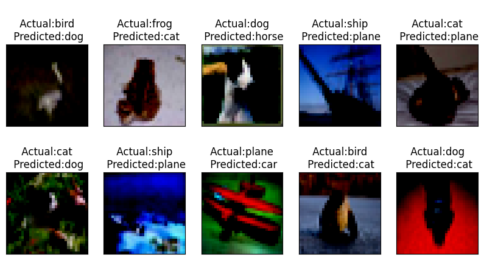
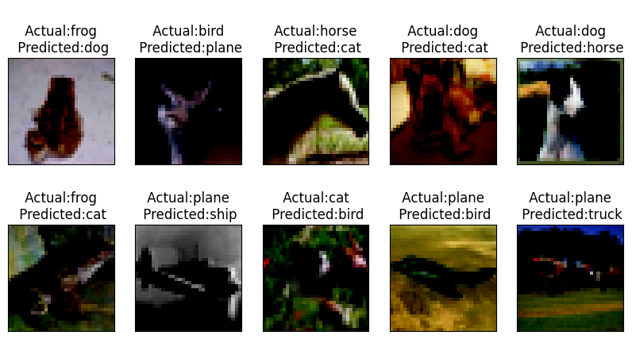
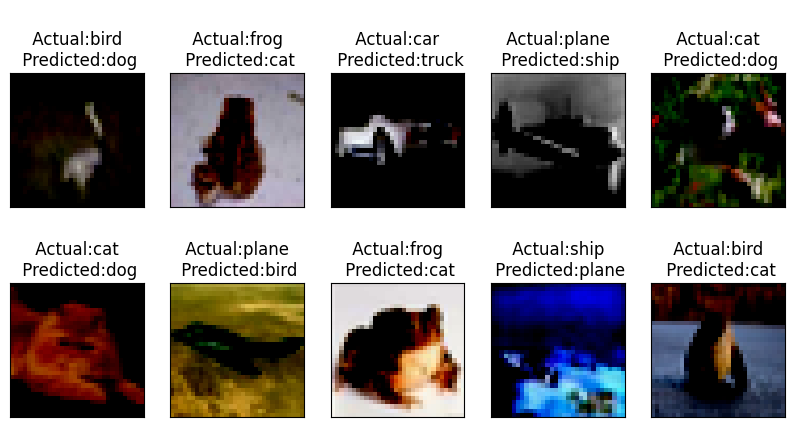
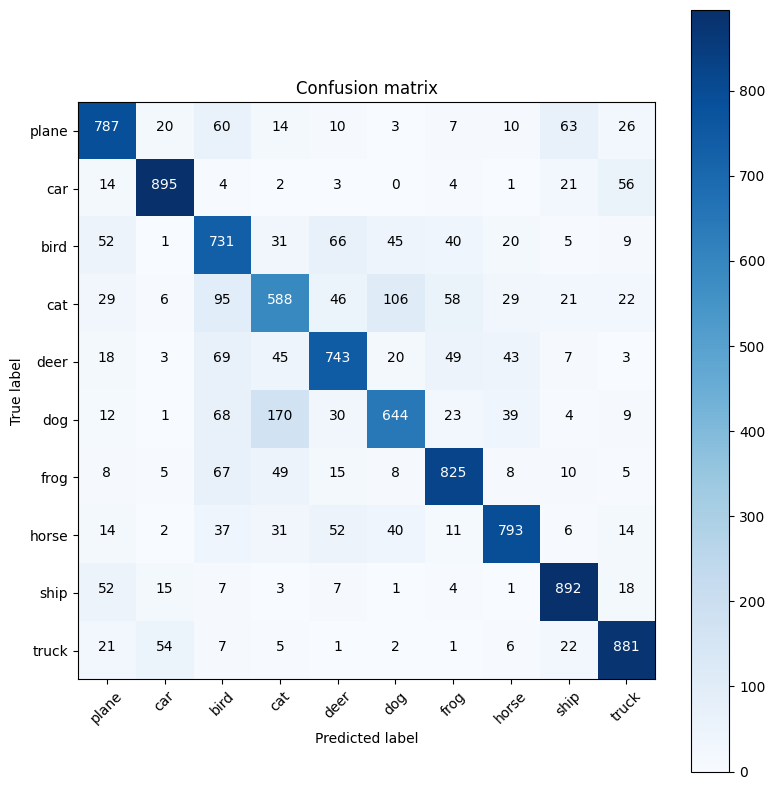
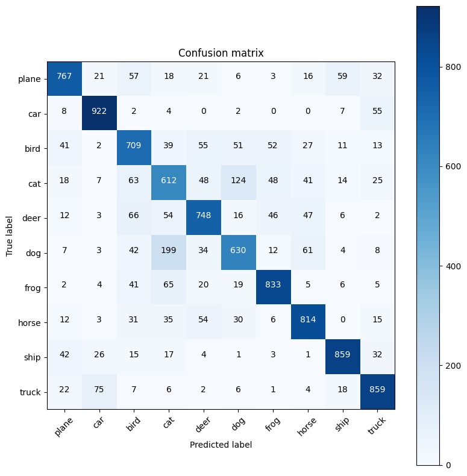

## Assignment S8 : 

* Change the dataset to CIFAR10
* Make this network:
C1 C2 c3 P1 C3 C4 C5 c6 P2 C7 C8 C9 GAP C10
* Keep the parameter count less than 50000
* Try and add one layer to another
* Max Epochs is 20
* You are making 3 versions of the above code (in each case achieve above 70% accuracy):
  * Network with Group Normalization
  * Network with Layer Normalization
  * Network with Batch Normalization
  * Print 10 Misclassified image.

**********************************************************************
* Model Trained with C1 C2 c3 P1 C3 C4 C5 c6 P2 C7 C8 C9 GAP c10 Network with below Hyperparameters
	* Batch Size: 128
	* lr : 0.01
	* Momentum :0.9
	* Total Parameters: 37,098
	* Transformations applied
    		* ColorJitter
    		* RandomHorizontalFlip(p=0.3)
    		* RandomRotation((-10., 10.))
	* Dropout = 0.01


* Network with Batch Normalization
  
	- [S8_BatchNormalization.ipynb](S8_BatchNormalization.ipynb)
	- Train Accuracy : 76.07%
	- Test Accuracy : 77.79%


* Network with Layer Normalization
   	- [S8_LayerNormalization.ipynb](S8_LayerNormalization.ipynb)
   	- Train Accuracy : 75 %
   	- Test Accuracy :  77.06%
   	  
 * Network with Group Normalization
   	- [S8_GroupNormalization.ipynb](S8_GroupNormalization.ipynb)
    	- Train Accuracy : 75.48%
    	- Test Accuracy : 77.53%
    
	
* Weights folder consists saved model objects/weights for reuse purpose.
* Model.py - Consists Network class
* Utils.py - Consists helper classes related to Train, test etc
* visualize.py - Consists helper classes used for visualization.

   
**Network Summary**

```
---------------------------------------------------------------
        Layer (type)               Output Shape         Param #
================================================================
            Conv2d-1           [-1, 10, 32, 32]             270
              ReLU-2           [-1, 10, 32, 32]               0
         GroupNorm-3           [-1, 10, 32, 32]              20
           Dropout-4           [-1, 10, 32, 32]               0
            Conv2d-5           [-1, 10, 32, 32]             900
              ReLU-6           [-1, 10, 32, 32]               0
         GroupNorm-7           [-1, 10, 32, 32]              20
           Dropout-8           [-1, 10, 32, 32]               0
            Conv2d-9           [-1, 16, 32, 32]             160
        MaxPool2d-10           [-1, 16, 16, 16]               0
           Conv2d-11           [-1, 24, 16, 16]           3,456
             ReLU-12           [-1, 24, 16, 16]               0
        GroupNorm-13           [-1, 24, 16, 16]              48
          Dropout-14           [-1, 24, 16, 16]               0
           Conv2d-15           [-1, 16, 16, 16]           3,456
             ReLU-16           [-1, 16, 16, 16]               0
        GroupNorm-17           [-1, 16, 16, 16]              32
          Dropout-18           [-1, 16, 16, 16]               0
           Conv2d-19           [-1, 32, 16, 16]           4,608
             ReLU-20           [-1, 32, 16, 16]               0
        GroupNorm-21           [-1, 32, 16, 16]              64
          Dropout-22           [-1, 32, 16, 16]               0

================================================================
Total params: 37,098
Trainable params: 37,098
Non-trainable params: 0
----------------------------------------------------------------
Input size (MB): 0.01
Forward/backward pass size (MB): 1.57
Params size (MB): 0.14
Estimated Total Size (MB): 1.72
----------------------------------------------------------------
```

### Sample CIFAR10 data : 




# 


## Train_Test Accuracy vs Loss Graph : 


### Graph - Batch Normalization 



## Graph - Group Normalization 


## Graph - Layer Normalization 



## Misclassified Images:

### Misclassified Image - Batch Normalization 

### Misclassified Image - Group Normalization 

### Mispredicted Image - Layer Normalization 



## Confusion Matrices :

### Confusion Matrix Model - Batch Normalization 

### Confusion Matrix Model - Group Normalization 

### Confusion Matrix Model - Layer Normalization 


