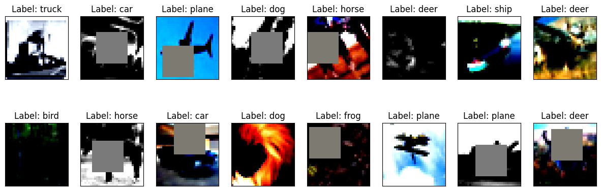
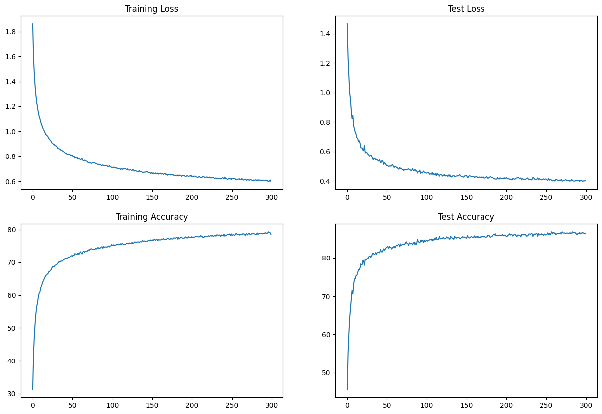
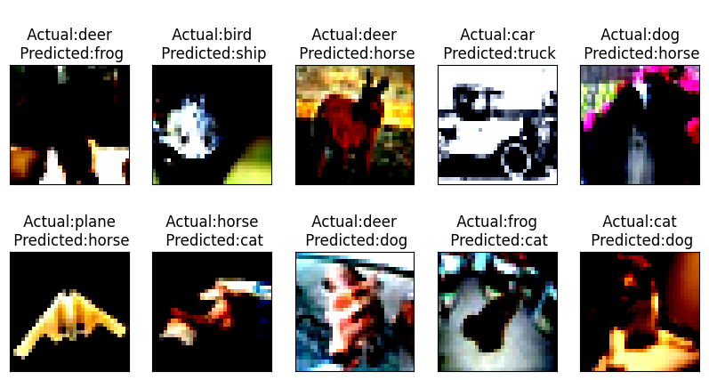
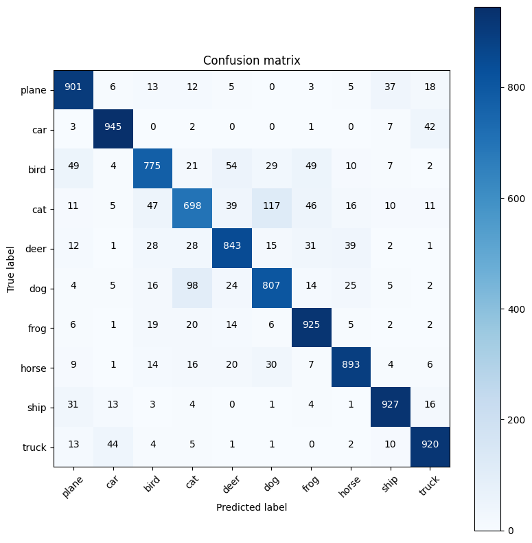

## S9 - Assignment Objective:

1. Write a new network that  architecture to C1C2C3C40 (No MaxPooling, but 3 convolutions, where the last one has a stride of 2 instead) (If you can figure out how to use Dilated kernels here instead of MP or strided convolution, then 200pts extra!)
2. Total RF must be more than 44
3. one of the layers must use Depthwise Separable Convolution
4. one of the layers must use Dilated Convolution
5. use GAP (compulsory):- add FC after GAP to target #of classes (optional)
6. use albumentation library and apply:
  * horizontal flip
  * shiftScaleRotate
  * coarseDropout (max_holes = 1, max_height=16px, max_width=16, min_holes = 1, min_height=16px, min_width=16px, fill_value=(mean of your dataset), mask_fill_value = None)
7. Achieve 85% accuracy, as many epochs as you want. Total Params to be less than 200k.
make sure you're following code-modularity (else 0 for full assignment) 
8. upload to Github

-----
## Project Files:
* [model.py](model.py) : Contains Model Architecture
* [data.py](data.py)  : CIFAR10 data definition
* [utils.py](utils.py) : Contains helper funtions modularized to check stats,data loader,train and test etc
* [visualize.py](visualize.py) : Contains functions to create visualization of samples
* [transformation.py](transformation.py) : Contains funtions to normalize and data augmentation using albumentations package
* [S9_Assignment.ipynb](S9_Assignment.ipynb) : Contains implemntation code
* [Weights](Weights) : Saved Model Artifacts

## Model Summary :
* Total Parameters : 162,296 (<200k)
* Maxpooling replaced with Dilated Conv 2
* Depth wise separable Conv used as per directed


```
----------------------------------------------------------------
        Layer (type)               Output Shape         Param #
================================================================
            Conv2d-1           [-1, 16, 32, 32]             432
       BatchNorm2d-2           [-1, 16, 32, 32]              32
         Dropout2d-3           [-1, 16, 32, 32]               0
            Conv2d-4           [-1, 32, 32, 32]           4,608
       BatchNorm2d-5           [-1, 32, 32, 32]              64
         Dropout2d-6           [-1, 32, 32, 32]               0
            Conv2d-7           [-1, 32, 32, 32]           9,216
       BatchNorm2d-8           [-1, 32, 32, 32]              64
         Dropout2d-9           [-1, 32, 32, 32]               0
           Conv2d-10           [-1, 32, 14, 14]           9,216
      BatchNorm2d-11           [-1, 32, 14, 14]              64
        Dropout2d-12           [-1, 32, 14, 14]               0
           Conv2d-13           [-1, 32, 14, 14]           9,216
      BatchNorm2d-14           [-1, 32, 14, 14]              64
        Dropout2d-15           [-1, 32, 14, 14]               0
           Conv2d-16           [-1, 52, 14, 14]          14,976
      BatchNorm2d-17           [-1, 52, 14, 14]             104
        Dropout2d-18           [-1, 52, 14, 14]               0
           Conv2d-19             [-1, 64, 5, 5]          29,952
      BatchNorm2d-20             [-1, 64, 5, 5]             128
        Dropout2d-21             [-1, 64, 5, 5]               0
           Conv2d-22             [-1, 64, 5, 5]              64
      BatchNorm2d-23             [-1, 64, 5, 5]             128
        Dropout2d-24             [-1, 64, 5, 5]               0
           Conv2d-25             [-1, 64, 5, 5]          36,864
      BatchNorm2d-26             [-1, 64, 5, 5]             128
        Dropout2d-27             [-1, 64, 5, 5]               0
           Conv2d-28             [-1, 64, 4, 4]           4,096
      BatchNorm2d-29             [-1, 64, 4, 4]             128
        Dropout2d-30             [-1, 64, 4, 4]               0
           Conv2d-31             [-1, 64, 4, 4]          36,864
      BatchNorm2d-32             [-1, 64, 4, 4]             128
        Dropout2d-33             [-1, 64, 4, 4]               0
           Conv2d-34             [-1, 10, 4, 4]           5,760
        AvgPool2d-35             [-1, 10, 1, 1]               0
================================================================
Total params: 162,296
Trainable params: 162,296
Non-trainable params: 0
----------------------------------------------------------------
Input size (MB): 0.01
Forward/backward pass size (MB): 2.55
Params size (MB): 0.62
Estimated Total Size (MB): 3.18
----------------------------------------------------------------
```
## Model Architecuture Code:
```
class Net(nn.Module):
    #This defines the structure of the NN.
    def __init__(self,norm='BN',drop=0.01):
      super(Net,self).__init__()

      ##Block 1
      self.conv1 = nn.Conv2d(3, 16, 3, padding=1,bias=False)
      self.norm1 = self.select_norm(norm,16)
      self.conv2 = nn.Conv2d(16, 32, 3, padding=1,bias=False)
      self.norm2 = self.select_norm(norm,32)
      self.conv3 = nn.Conv2d(32, 32, 3, padding=1,bias=False)
      self.norm3 = self.select_norm(norm,32)
      self.dilated_conv1 = nn.Conv2d(32,32,3,stride = 2,dilation=2,padding=0,bias=False)
      self.dilated_norm1 = self.select_norm(norm,32)
      ##Block 2

      self.conv4 = nn.Conv2d(32, 32, 3, padding=1,bias=False)
      self.norm4 = self.select_norm(norm,32)
      self.conv5 = nn.Conv2d(32, 52, 3, padding=1,bias=False)
      self.norm5 = self.select_norm(norm,52)
      self.dilated_conv2 = nn.Conv2d(52,64,3,stride = 2,dilation=2,padding=0,bias=False)
      self.dilated_norm2 = self.select_norm(norm,64)
      ## Block 3
      
      self.depthwise_conv1 = nn.Conv2d(64, 64,1,stride = 1,groups = 64, padding=0,bias=False)
      self.depthwise_norm1 = self.select_norm(norm,64)
      self.conv6 = nn.Conv2d(64, 64, 3, padding=1,bias=False)
      self.norm6 = self.select_norm(norm,64)
      self.strided_conv1 = nn.Conv2d(64,64,1,stride = 2,padding=1,bias=False)
      self.strided_norm1 = self.select_norm(norm,64)
      ## Block 4
      self.conv7 = nn.Conv2d(64, 64, 3, padding=1,bias=False)
      self.norm7 = self.select_norm(norm,64)
      self.conv8 = nn.Conv2d(64,10,3,stride = 1, padding=1,bias=False)

          
      self.drop = nn.Dropout2d(drop)

      self.gap = nn.AvgPool2d(4)

      

    def forward(self, x):
        x = self.drop(self.norm1(F.relu(self.conv1(x))))
        x = self.drop(self.norm2(F.relu(self.conv2(x))))
        x = self.drop(self.norm3(F.relu(self.conv3(x))))
        x = self.drop(self.dilated_norm1(F.relu(self.dilated_conv1(x))))

        x = self.drop(self.norm4(F.relu(self.conv4(x))))
        x = self.drop(self.norm5(F.relu(self.conv5(x))))
        x = self.drop(self.dilated_norm2(F.relu(self.dilated_conv2(x))))

   

        x = self.drop(self.depthwise_norm1(F.relu(self.depthwise_conv1(x))))
        x = self.drop(self.norm6(F.relu(self.conv6(x))))
        x = self.drop(self.strided_norm1(F.relu(self.strided_conv1(x))))
         
        x = self.drop(self.norm7(F.relu(self.conv7(x))))
        x = self.conv8(x)
        x = self.gap(x)
      
        x = x.view(-1, 10)
        return F.log_softmax(x,dim=-1) 
  
        
    def select_norm(self, norm, channels,groupsize=2):
        if norm == 'BN':
            return nn.BatchNorm2d(channels)
        elif norm == 'LN':
            return nn.GroupNorm(1,channels)
        elif norm == 'GN':
            return nn.GroupNorm(groupsize,channels)            
```
## Augumentation Code :
* Implemented in transformation.py file

```
import albumentations as A
from albumentations.pytorch import ToTensorV2 

def get_train_aug_transform(mu, sigma):

    """
    Args:
        tensor (Tensor): Tensor image of size (C, H, W) to be normalized.
    Returns:
        Tensor: Normalized image.
    """
    train_transform = A.Compose([
                             A.HorizontalFlip(p=0.4),
                             A.ShiftScaleRotate(),
                             A.Normalize(mean=(mu), 
                                         std=(sigma)),
                             A.CoarseDropout(max_holes=1, 
                                             max_height=16, 
                                             max_width=16, 
                                             min_holes=1, 
                                             min_height=16,
                                             min_width=16,
                                             fill_value=(mu)),
                             A.ToGray(),
                             ToTensorV2(),
])

    return(train_transform)

```
## Sample after tranformation :


## Training Results :
* Model consistently getting Test accuracy > 85 from 143 EPOCH
* Total Epoch Ran : 300
* Best Train Accuracy : 79.29
* Best Test Accuracy :  86.78

## Training and Test accuracy Log ( Last 15) :
```
EPOCH: 283
Train: Loss=0.9803 Batch_id=390 Accuracy=78.49: 100%|██████████| 391/391 [00:13<00:00, 29.19it/s]
Test set: Average loss: 0.4018, Accuracy: 8678/10000 (86.78%)

EPOCH: 284
Train: Loss=0.8102 Batch_id=390 Accuracy=78.71: 100%|██████████| 391/391 [00:13<00:00, 29.13it/s]
Test set: Average loss: 0.3993, Accuracy: 8663/10000 (86.63%)

EPOCH: 285
Train: Loss=0.5818 Batch_id=390 Accuracy=78.72: 100%|██████████| 391/391 [00:13<00:00, 29.11it/s]
Test set: Average loss: 0.3994, Accuracy: 8655/10000 (86.55%)

EPOCH: 286
Train: Loss=0.6017 Batch_id=390 Accuracy=78.74: 100%|██████████| 391/391 [00:14<00:00, 27.36it/s]
Test set: Average loss: 0.3990, Accuracy: 8661/10000 (86.61%)

EPOCH: 287
Train: Loss=0.7214 Batch_id=390 Accuracy=78.79: 100%|██████████| 391/391 [00:13<00:00, 28.93it/s]
Test set: Average loss: 0.4020, Accuracy: 8641/10000 (86.41%)

EPOCH: 288
Train: Loss=0.7235 Batch_id=390 Accuracy=78.65: 100%|██████████| 391/391 [00:13<00:00, 29.49it/s]
Test set: Average loss: 0.4025, Accuracy: 8615/10000 (86.15%)

EPOCH: 289
Train: Loss=0.4069 Batch_id=390 Accuracy=78.72: 100%|██████████| 391/391 [00:13<00:00, 28.62it/s]
Test set: Average loss: 0.4048, Accuracy: 8606/10000 (86.06%)

EPOCH: 290
Train: Loss=0.5801 Batch_id=390 Accuracy=78.78: 100%|██████████| 391/391 [00:13<00:00, 29.15it/s]
Test set: Average loss: 0.4007, Accuracy: 8646/10000 (86.46%)

EPOCH: 291
Train: Loss=0.5841 Batch_id=390 Accuracy=78.85: 100%|██████████| 391/391 [00:13<00:00, 28.97it/s]
Test set: Average loss: 0.4052, Accuracy: 8627/10000 (86.27%)

EPOCH: 292
Train: Loss=0.5754 Batch_id=390 Accuracy=79.02: 100%|██████████| 391/391 [00:13<00:00, 28.79it/s]
Test set: Average loss: 0.3967, Accuracy: 8660/10000 (86.60%)

EPOCH: 293
Train: Loss=0.7233 Batch_id=390 Accuracy=78.82: 100%|██████████| 391/391 [00:13<00:00, 28.93it/s]
Test set: Average loss: 0.4046, Accuracy: 8627/10000 (86.27%)

EPOCH: 294
Train: Loss=0.6763 Batch_id=390 Accuracy=78.91: 100%|██████████| 391/391 [00:13<00:00, 28.00it/s]
Test set: Average loss: 0.4044, Accuracy: 8633/10000 (86.33%)

EPOCH: 295
Train: Loss=0.7916 Batch_id=390 Accuracy=78.90: 100%|██████████| 391/391 [00:13<00:00, 28.57it/s]
Test set: Average loss: 0.3977, Accuracy: 8662/10000 (86.62%)

EPOCH: 296
Train: Loss=0.5545 Batch_id=390 Accuracy=79.29: 100%|██████████| 391/391 [00:13<00:00, 28.00it/s]
Test set: Average loss: 0.4008, Accuracy: 8644/10000 (86.44%)

EPOCH: 297
Train: Loss=0.6689 Batch_id=390 Accuracy=79.06: 100%|██████████| 391/391 [00:13<00:00, 28.64it/s]
Test set: Average loss: 0.3986, Accuracy: 8653/10000 (86.53%)

EPOCH: 298
Train: Loss=0.5768 Batch_id=390 Accuracy=79.02: 100%|██████████| 391/391 [00:13<00:00, 28.49it/s]
Test set: Average loss: 0.4004, Accuracy: 8628/10000 (86.28%)

EPOCH: 299
Train: Loss=0.6176 Batch_id=390 Accuracy=78.55: 100%|██████████| 391/391 [00:13<00:00, 28.64it/s]
Test set: Average loss: 0.4028, Accuracy: 8634/10000 (86.34%)

```

## Train_Test Accuracy vs Loss Graph : 


## Misclassified images:


## Confusion Matrix:

